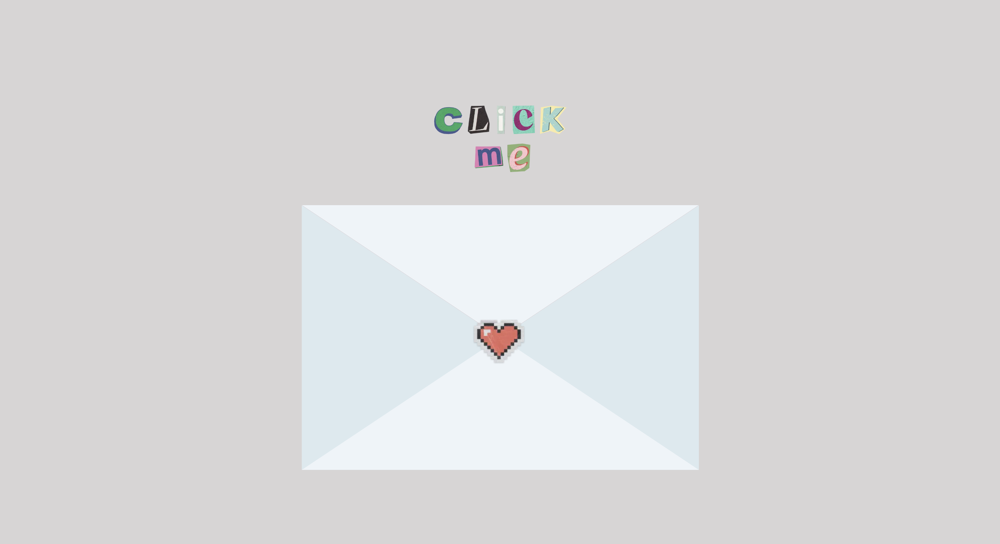
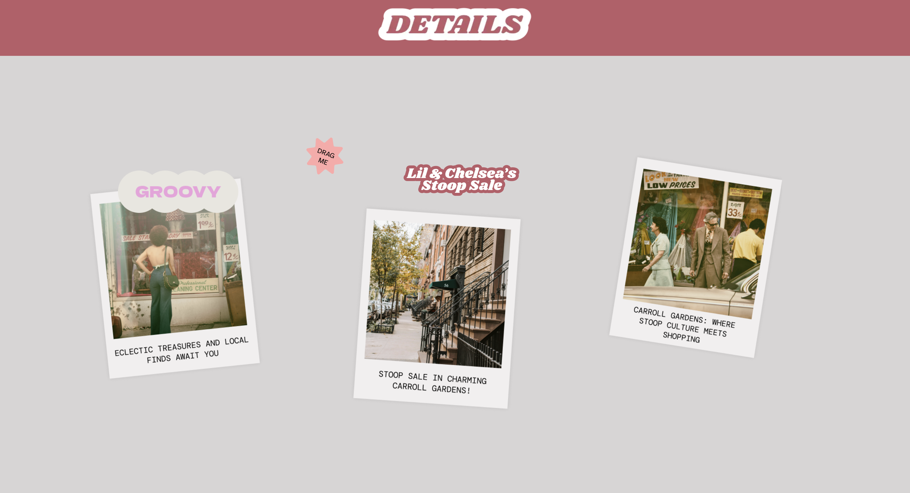

# Codedex Summer Hackaton '24 
[Website](https://codedex-invitation-hkyjg331d-kat-limquecos-projects.vercel.app/)

## Preview 




**Tech Stack**: Next.js, React, Typescript, TailwindCSS

**Project tidbit**: 
- This is an interactive website submission for Track 2 of [Codedex’s Summer ’24 Hackathon](https://www.codedex.io/hackathon).
- The main features is are an animated envelope that opens to reveal content on click, draggable elements that can be freely moved around, and an embedded Google Map via [Maps Javascript API](https://developers.google.com/maps/documentation/javascript/overview)

**Future Considerations**: 
- Making interface more user-friendly and adaptable across multiple screen views (currently works best on full web view).

## Setting Up 
### Getting Started

First, run the development server:

```bash
npm run dev
# or
yarn dev
# or
pnpm dev
# or
bun dev
```

Open [http://localhost:3000](http://localhost:3000) with your browser to see the result.

You can start editing the page by modifying `app/page.tsx`. The page auto-updates as you edit the file.

